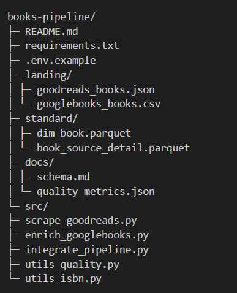

# books-pipeline

Scraping y enriquecimiento de libros con integración a un modelo canónico. Flujo completo: Goodreads (scraping) → Google Books (API) → Parquet con normalizaciones, deduplicación y métricas.

- Entradas: `landing/goodreads_books.json`, `landing/googlebooks_books.csv`
- Salidas: `standard/dim_book.parquet`, `standard/book_source_detail.parquet`, `docs/schema.md`, `docs/quality_metrics.json`
- Detalle: `book_source_detail.parquet` incluye la columna unificada `autor/es` (fusión de `author` y `authors`) y no conserva las columnas originales.

---

## 📦 Demo rápida

1) Crear y activar entorno virtual
python -m venv .venv

Windows
.venv\Scripts\activate

macOS / Linux
source .venv/bin/activate
2) Instalar dependencias
pip install -r requirements.txt

3) Ejecutar pipeline paso a paso
python -m src.scrape_goodreads
python -m src.enrich_googlebooks
python -m src.integrate_pipeline

text

Salidas esperadas:
- `standard/dim_book.parquet`
- `standard/book_source_detail.parquet`
- `docs/schema.md`
- `docs/quality_metrics.json`

---

## ✅ Requisitos

- Python 3.11+
- Google Chrome instalado (el driver se gestiona automáticamente por Selenium Manager en versiones recientes)
- Pip y venv disponibles

Dependencias clave (ver `requirements.txt`):
- selenium, beautifulsoup4, requests
- pandas, numpy, pyarrow
- libs auxiliares listadas en el archivo

---

## 📥 Instalación

git clone https://github.com/<tu-usuario>/books-pipeline.git
cd books-pipeline

python -m venv .venv

Windows
.venv\Scripts\activate

macOS / Linux
source .venv/bin/activate
pip install -r requirements.txt

text

Variables opcionales (no necesarias para el flujo básico):
- Copia `.env.example` a `.env` y añade tu `GOOGLE_BOOKS_API_KEY` si quieres elevar cuotas.

---

## ▶️ Ejecución

1) Scraping (Goodreads → JSON)
python -m src.scrape_goodreads

text
- Genera `landing/goodreads_books.json` con metadatos de búsqueda (query, UA, timestamp, total).
- Edita dentro del script parámetros como `query="data science"`, `min_items=12`, `headless=True`.

2) Enriquecimiento (Google Books → CSV)
python -m src.enrich_googlebooks

text
- Lee el JSON previo y crea `landing/googlebooks_books.csv` (UTF-8, separador coma).
- Genera `landing/googlebooks_books.csv.meta.json` con separador/codificación y timestamp.

3) Integración y estandarización (JSON+CSV → Parquet)
python -m src.integrate_pipeline

text
- Emite:
  - `standard/dim_book.parquet`
  - `standard/book_source_detail.parquet` (incluye `autor/es`)
  - `docs/schema.md`
  - `docs/quality_metrics.json`

---

## 🗂️ Estructura

Notas:
- `landing/` es de solo lectura en la fase de integración.
- `standard/` contiene datasets canónicos limpios.
- `docs/` mantiene documentación y métricas.

---

## 🔍 Detalles técnicos

Scraper (Goodreads):
- URL base: `https://www.goodreads.com/search`
- Selectores: `table.tableList tr`, `.bookTitle`, `.authorName`, `.minirating`
- Anti-bot: user-agent de Chrome, ocultación básica de webdriver, pausas/scroll humano.
- Campos: `title, author, rating, ratings_count, book_url, isbn10, isbn13`

Google Books API:
- Endpoint: `https://www.googleapis.com/books/v1/volumes`
- Búsqueda: por `isbn` (preferente) o por `title+author`
- Campos: `gb_id, title, subtitle, authors, publisher, pub_date, language, categories, isbn13, isbn10, price_amount, price_currency`

Integración:
- ID preferente: `isbn13`; si falta, se genera `book_id` estable con hash de `(titulo_normalizado, autor_principal, editorial, fecha_publicacion)`
- Normalizaciones:
  - Fechas: ISO-8601 (`YYYY-MM-DD`)
  - Idioma: BCP-47 (`es`, `en-US`, `pt-BR`)
  - Moneda: ISO-4217 (`EUR`, `USD`), `precio` en decimal con punto
- Deduplicación:
  - Clave primaria: `isbn13` (si no, hash estable)
  - Supervivencia: más campos completos; preferencia por título/precio de Google Books cuando disponibles
  - Listas: unión y de-duplicación (autores/categorías)
- Detalle por fuente:
  - `book_source_detail.parquet` incluye `autor/es` (fusión de `author` y `authors`) y elimina las columnas originales para evitar duplicidad

---

## 📊 Métricas y documentación

- `docs/quality_metrics.json`:
  - `total_dim_book`, `% nulos` en título/isbn13/precio, filas por fuente, duplicados detectados
- `docs/schema.md`:
  - Campos, tipos, formatos, reglas de ID y supervivencia, listas y formatos controlados

---

## 🧰 Solución de problemas

Chrome/Driver:
- Mantén Chrome actualizado.
- Si hay problemas con el controlador, actualiza Selenium: `pip install --upgrade selenium`.
- Como alternativa, instala manualmente ChromeDriver acorde a tu versión de Chrome y agrégalo al PATH.

Errores por columnas o NaN:
- Ejecuta en orden: scraping → enriquecimiento → integración.
- La integración robustece `best_isbn13` y `best_isbn10` y evita fallos de `len()` sobre `NaN` convirtiendo y filtrando valores no string.

Buenas prácticas:
- No dispares demasiadas ejecuciones consecutivas para evitar bloqueos del sitio.
- Ajusta `min_items` a 10–15 para pruebas y sube progresivamente.

---

## 🤝 Contribuir

Se aceptan PRs:
- Logs y trazabilidad por regla/archivo
- Proxy y rotación de user-agent
- Métricas ampliadas y validaciones de dominios
- Tests automatizados y CI

---
